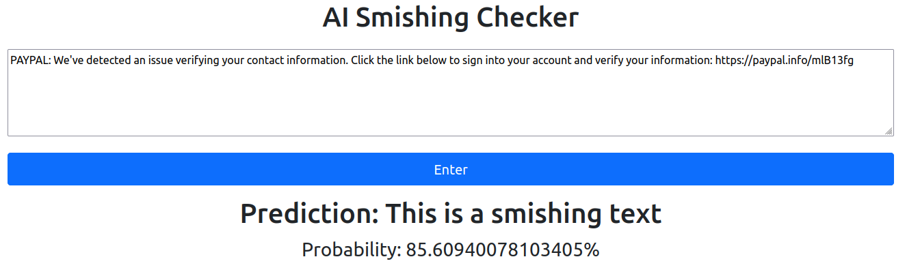

# Smishing Text Analysis Web Application

This Django Web Application is a wrapper for a trained voting classifier model that combines the results of 6 different classifiers through soft voting. The voting classifier has been trained on a dataset, which combines a public dataset and 240 smishing texts that have been generated using Chat-GPT 3.5. 

## Installation

It is best practice use a [virtual environment](https://packaging.python.org/en/latest/guides/installing-using-pip-and-virtual-environments/) to isolate package installations from other projects. To create a virtual environment, go to the project root directory and run the following command. This will create a new virtual environment in a local folder named .venv. After this has installed, activate the virtual environment.

```bash
python3 -m venv .venv
source .venv/bin/activate
```

Use the package manager [pip](https://pip.pypa.io/en/stable/) to install the packages in the requirements.txt file.

```bash
pip3 install -r requirements.txt
```

## GUI Usage

To start the web server, run the following command in the project root directory: ~/SmishingSMSPredictor and navigate to http://127.0.0.1:8000/ in your web browser.

```bash
python3 manage.py runserver
```
## Command Line Usage

The application creates an instance of the combinedClassifier.py class, which can be used in the command line like a library. Using this library, an instance of the CombinedClassifier model can be instantiated which can be trained, saved and loaded for later use.

```python
#Import libraries
import pandas as pd
from combinedClassifier import CombinedClassifier

#Create classifier
model = CombinedClassifier()
model.load_dataset("./Datasets/combined_dataset.csv")

#The option to save the model appears in this function
#WARNING: Saving the model will OVERWRITE the current model joblib files saved in memory
model.train()
```
The model saves 2 joblib files, one for the model and one for the text vectoriser. These files need to be loaded into the model before it can make predictions:

```python
model = CombinedClassifier()
model.load_model("voting_classifier.joblib", "vectorizer.joblib")
```

The model can then make predictions on unseen data using the following code. The unseen data must be in a python list and then converted to a Series using pandas.

```python
#Example data
unseen = ["You have won $5000. The prize needs to be claimed ASAP. Please reply with your bank information so we can deposit the money into your account.", "Hey, see you soon!"]
predicted = model.predict(pd.Series(unseen))
print(predicted)
```

## Dataset
The model can be trained on any smishing dataset using a csv file of the following structure:

| Label    | Text          |
| -------- | ------------- |
| smish    | SMS GOES HERE |
| ham      | SMS GOES HERE |

Data must be labelled as either "smish" or "ham", and there must be two columns with the header "Label" and "Text".

## Resources used for this application

* Machine learning [tutorial](https://www.kaggle.com/code/llabhishekll/text-preprocessing-and-sms-spam-detection/notebook).
* Machine learning [voting classifier](https://scikit-learn.org/stable/modules/generated/sklearn.ensemble.VotingClassifier.html).
* Hypothesis testing [code](https://www.geeksforgeeks.org/understanding-hypothesis-testing/).
* Training [Dataset](https://www.kaggle.com/datasets/galactus007/sms-smishing-collection-data-set).
* [Scikit-learn](https://scikit-learn.org/stable/).


